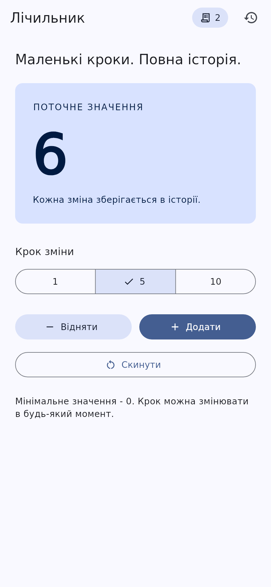
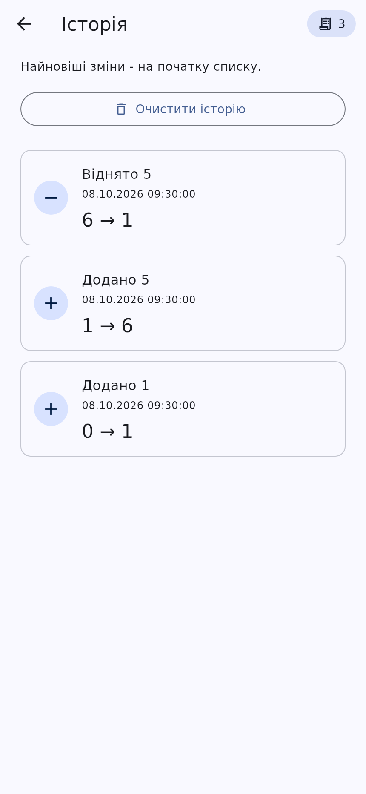
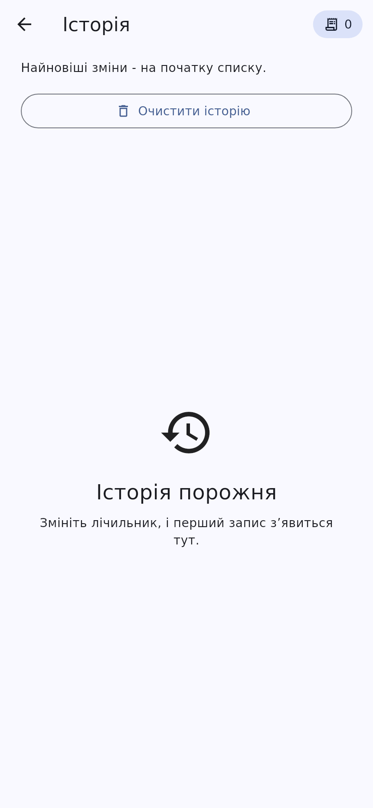
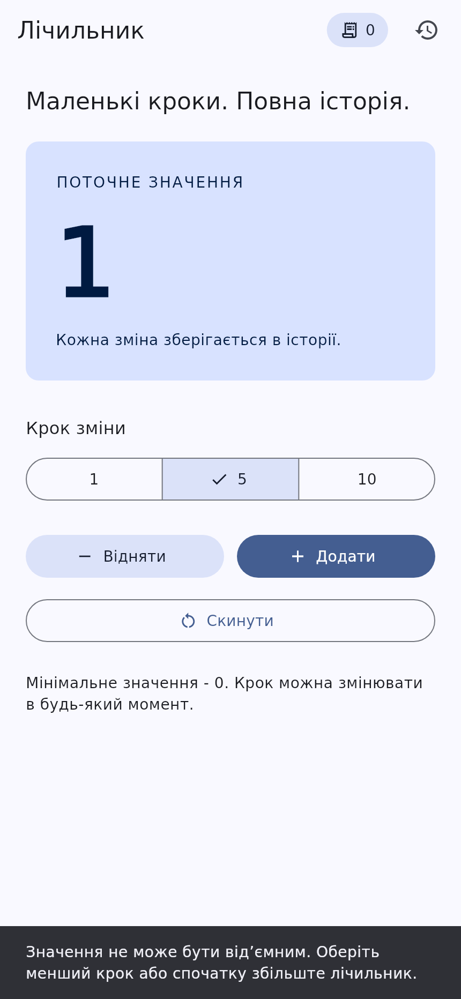

# Практична робота 6.1: базовий State Management у Flutter

**Варіант 1 - лічильник з історією.**
Дисципліна: «Програмування для мобільних платформ».

Застосунок підтримує додавання й віднімання з кроком **1 / 5 / 10**, скидання,
окремий екран історії та бейдж кількості записів на обох екранах.
Інтерфейс українською. Сторонніх пакетів керування станом немає:
прямі залежності - тільки `flutter` і `flutter_test` з Flutter SDK.

## Запуск

Потрібні Flutter **3.35.7** (Dart 3.9.2) або сумісна новіша версія та Git.
У репозиторії є платформи **Android** і **Web**.

```bash
flutter pub get
flutter run -d chrome
```

Для Android запустіть емулятор або під'єднайте пристрій із USB debugging:

```bash
flutter devices
flutter run -d DEVICE_ID
flutter build apk --debug
```

Замість `DEVICE_ID` підставте ідентифікатор з `flutter devices`.
Для Android потрібні Android SDK і JDK 17. Локальні шляхи SDK автоматично
записуються Flutter у `android/local.properties`; цей файл не комітиться.
Для Web потрібен Chrome, для запуску в іншому браузері:
`flutter run -d web-server` і відкриття адреси, надрукованої в терміналі.

## Обидва етапи в git

| Тег | Реалізація |
| --- | --- |
| `stage-1-lifting` | Значення та історія підняті у `_CounterAppState`; `setState`, параметри конструкторів та колбеки |
| `stage-2-inherited` | `CounterModel extends ChangeNotifier`, `CounterScope extends InheritedNotifier<CounterModel>`, статичний `of(context)` |

Для першого етапу з окремою робочою директорією:

```bash
git worktree add --detach ../counter-stage-1 stage-1-lifting
cd ../counter-stage-1
flutter pub get
flutter run -d chrome
```

Для перегляду другого етапу: `git switch --detach stage-2-inherited`.
Повернення до поточної гілки: `git switch main`.
Перегляд зміни архітектури: `git diff stage-1-lifting stage-2-inherited -- lib`.

## Таблиця стану

| Дані | Тип стану | Етап 1: де живуть | Етап 2: де живуть | Чому |
| --- | --- | --- | --- | --- |
| Поточне значення | Стан застосунку | `_CounterAppState._value` | `CounterModel._value` | Спільне з історією, не залежить від життєвого циклу сторінки |
| Історія змін | Стан застосунку | `_CounterAppState._history` | `CounterModel._history` | Потрібна окремому екрану та бейджам обох екранів |
| Кількість записів | Обчислюване значення | `_history.length` | `historyCount` | Не дублюємо вже наявні дані |
| Обраний крок | Ефемерний стан | `_CounterControlsState._step`, `setState` | Так само | Потрібен лише локальним елементам керування |
| Відкрита сторінка | Стан навігації | `_CounterAppState._historyVisible`, `setState` | `_AppNavigatorState._historyVisible`, `setState` | Не належить до бізнес-моделі |

Обраний крок зберігається при переході до історії та поверненні, оскільки
сторінка лічильника залишається в стеку `Navigator`. Після завершення
застосунку стан скидається: постійне збереження в цьому завданні не вимагається.

## Архітектура другого етапу

- `lib/models/counter_entry.dart` - незмінний запис з `const`-конструктором:
  час, тип дії, значення до та після.
- `lib/state/counter_model.dart` - операції `change`, `reset`, `clearHistory`;
  приватні дані, незмінний знімок історії через `List.unmodifiable`.
- `lib/state/counter_scope.dart` - доступ до моделі через `of(context)`.
- `lib/screens/` - навігація, екран лічильника та екран історії.
- `lib/widgets/` - лічильник, локальні елементи керування, бейдж і список.
- `lib/app.dart` - створення моделі в `initState` та її звільнення в `dispose`.

`CounterScope` стоїть **над `MaterialApp` і Navigator**, тому обидві сторінки
бачать ту саму модель. Передавання спільних даних через проміжні віджети
прибрано. Колбек `onOpenHistory` відповідає лише за навігацію.

У `build` підписуються тільки `CounterValue`, `HistoryBadge` і `HistoryList`:

```dart
final value = CounterScope.of(context).value;
```

Обробники кнопок читають модель без реєстрації залежності:

```dart
CounterScope.of(context, listen: false).change(_step);
```

Тому натискання «Додати» не перебудовує `CounterApp`, `AppNavigator`,
`CounterScreen` або `CounterControls`. Саме підписка визначає межі
перебудов; `const` лише допомагає повторно використовувати незмінні віджети.
Один `ChangeNotifier` повідомляє **всіх** своїх підписників: наприклад,
очищення історії може також перебудувати лічильник, хоча його число не змінилося.
При відкритій історії в дереві є два бейджі, один з них на прихованій сторінці.

`TextEditingController` не створюється, оскільки у варіанті 1 немає поля
введення. Єдиний власний об'єкт, що вимагає `dispose`, - `CounterModel`.

## Правила поведінки

1. Будь-яка успішна зміна числа створює рівно один запис і одну нотифікацію.
2. Записи показуються від нового до старого через `ListView.builder`.
3. Спроба отримати число нижче нуля відхиляється повністю: число та історія
   незмінні, користувач бачить пояснення у `SnackBar`.
4. Скидання ненульового числа створює запис «Скинуто до нуля».
   Скидання 0 у 0 не є зміною й не створює зайвого запису.
5. Очищення історії не змінює число; очищення порожньої історії не надсилає
   зайвої нотифікації.
6. Перезапуск застосунку починає нову сесію з нуля.

## Перевірки та відтворення доказів

Перевірено з Flutter 3.35.7 / Dart 3.9.2:

| Перевірка | Результат |
| --- | --- |
| `flutter analyze --fatal-infos`, обидва етапи | Без зауважень |
| Основні тести другого етапу | 10 пройшли |
| Сценарій інтерфейсу першого етапу | Пройшов |
| Окреме захоплення скриншотів і журналу | Пройшло |
| Release-збірка Web | Успішна |

Текстові результати команд збережено в `docs/verification/`.
Android-проєкт включено; APK у цьому середовищі не збирався.

```bash
flutter analyze --fatal-infos
flutter test --reporter expanded
flutter test test/evidence_test.dart --dart-define=CAPTURE_EVIDENCE=true
python3 tool/finalize_evidence.py
flutter build web --release
```

Або одна команда на Linux/macOS/Git Bash з установленим Python 3:

```bash
bash tool/verify.sh
```

`test/counter_model_test.dart` перевіряє порядок і незмінність історії,
час, обидві операції, скидання, очищення, межу нуля та кількість нотифікацій.
`test/widget_test.dart` перевіряє основний сценарій через інтерфейс
і повернення системною кнопкою «Назад».
`test/rebuild_test.dart` перевіряє точний набір перебудованих віджетів,
збереження кроку й незалежність числа від очищення історії.
`test/evidence_test.dart` окремо створює PNG і реальний журнал `debugPrint`.
Він пропускається без прапорця `CAPTURE_EVIDENCE`, щоб звичайний запуск
тестів не переписував документацію.

Шрифт DejaVu Sans включено для відтворюваності українського тексту на
скриншотах; ліцензія - `assets/fonts/LICENSE.txt`. Це ресурс, а не пакет.

GitHub Actions перевіряє основну гілку та тег першого етапу, збирає Web,
публікує журнали й скриншоти як артефакт `flutter-evidence`.
CI не комітить файли автоматично. Для включення доказів у репозиторій
виконайте наведені команди або завантажте артефакт, а потім:

```bash
git add README.md docs pubspec.lock
git commit -m "docs: record verified Flutter build and screenshots"
git push
```

## Журнал перебудов і скриншоти

<!-- EVIDENCE:START -->

Журнал нижче записано під час виконання `test/evidence_test.dart`.
Скриншоти є рендерами справжніх Flutter-віджетів у тестовому середовищі.
Час записів фіксований для відтворюваності знімків.

```text
ACTION: increment by 1
build: HistoryBadge
build: CounterValue

ACTION: select step 5
build: CounterControls

ACTION: clear history
build: HistoryList
build: HistoryBadge
build: HistoryBadge
build: CounterValue
```

### Лічильник



### Історія



### Порожня історія



### Захист від від’ємного значення



<!-- EVIDENCE:END -->

## Як здати

За умовою здається **посилання на GitHub repository**, а не ZIP.
Після розпакування готової роботи збережіть каталог `.git`: у ньому коміти
й обидва теги. Якщо розпаковувач його не відновив, клонуйте вкладений bundle:

```bash
git clone practice-06-counter.bundle counter-submission
cd counter-submission
```

Створіть порожній GitHub-репозиторій без автоматичного README/.gitignore,
потім у корені проєкту виконайте, замінивши `YOUR_LOGIN` своїм логіном:

```bash
git remote add origin https://github.com/YOUR_LOGIN/practice-06-counter.git
git push -u origin main
git push origin stage-1-lifting stage-2-inherited
```

Якщо репозиторій відновлено через `git clone` з bundle, `origin` уже існує.
У цьому випадку замість `git remote add origin ...` використайте:

```bash
git remote set-url origin https://github.com/YOUR_LOGIN/practice-06-counter.git
```

У GitHub перевірте два теги й успішний запуск Actions. У Google Classroom
вставте посилання на репозиторій. `build/`, SDK, кеші та локальні налаштування
не входять до git. Історію роботи можна переглянути через `git log --oneline`.

## Висновок

Спільний стан піднято до найближчого спільного предка на першому етапі,
потім винесено в `ChangeNotifier` та надано через `InheritedNotifier`.
Ефемерний вибір кроку лишився локальним. Підписки в кінцевих віджетах
відокремлюють оновлення даних від перебудов каркаса екрана.

## Джерела

- [Ephemeral state and app state](https://docs.flutter.dev/data-and-backend/state-mgmt/ephemeral-vs-app)
- [InheritedNotifier](https://api.flutter.dev/flutter/widgets/InheritedNotifier-class.html)
- [ChangeNotifier](https://api.flutter.dev/flutter/foundation/ChangeNotifier-class.html)
- [State.setState](https://api.flutter.dev/flutter/widgets/State/setState.html)
