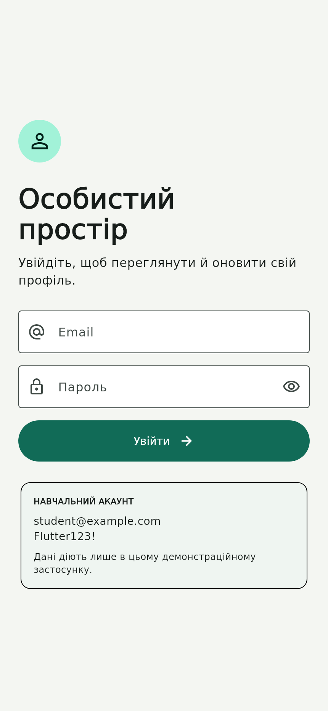
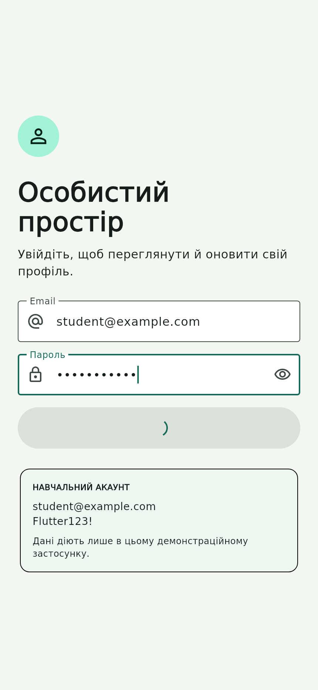
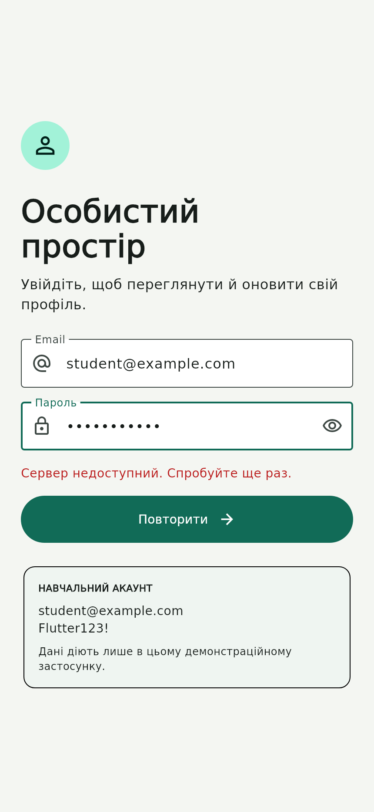
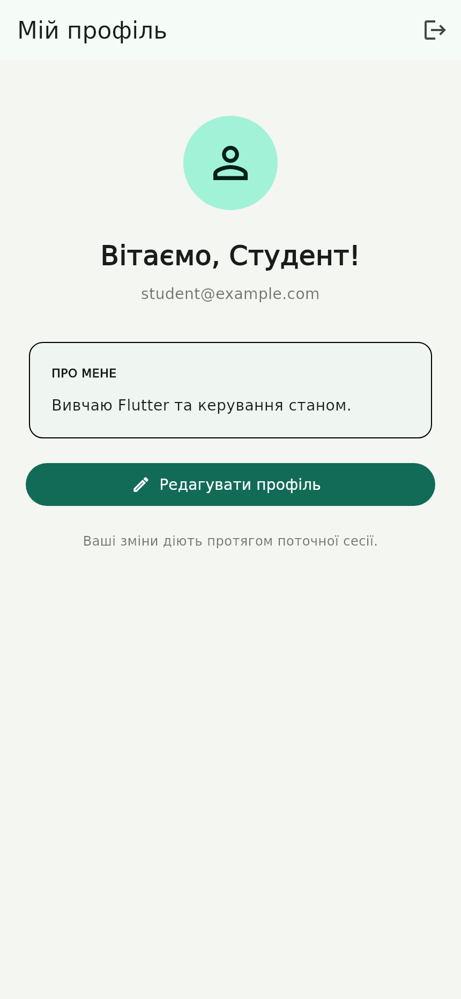
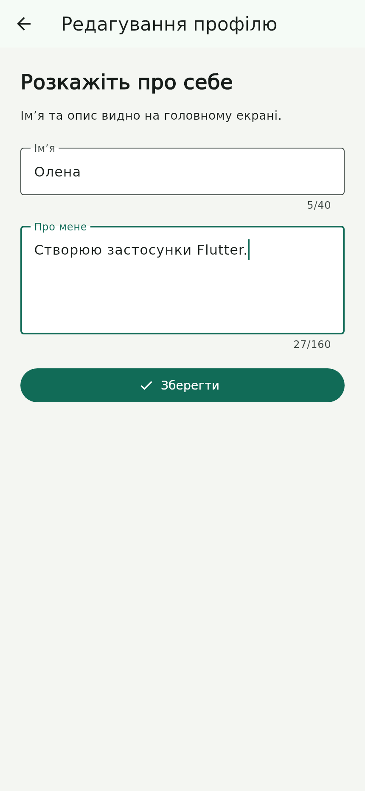
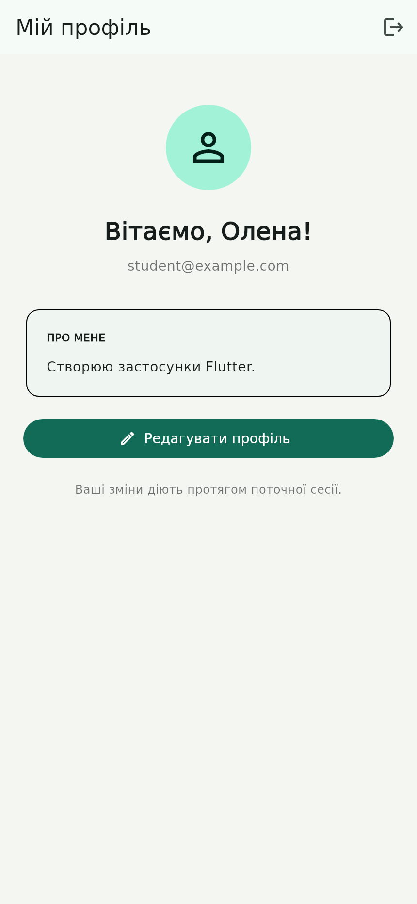

# Практична робота 6.2 — керування станом із Provider

**Варіант 2: авторизація та профіль.** Застосунок «Особистий простір» реалізує вхід, перевірку полів, імітацію запиту до сервера, повторну спробу після помилки, редагування профілю та вихід.

Друга частина підготовлена в локальній гілці `practice-06-part2`; гілка `main` містить попередню роботу. Автоматична публікація заблокована відповіддю GitHub `403: Resource not accessible by integration`. Архів постачання містить повну історію в Git bundle та інструкцію публікації. Після виконання `git push -u origin practice-06-part2` робота буде доступна за [посиланням на гілку](https://github.com/vldxrks/practice-06/tree/practice-06-part2), яке можна здати в Classroom. Звіт і докази виконання наведено нижче.

## Запуск

Якщо ви працюєте з отриманим архівом, відкрийте каталог `project/` і виконайте команди від `flutter pub get`. Команда `git clone` нижче призначена для використання після публікації гілки.

Перевірено на **Flutter 3.35.7 / Dart 3.9.2**. Залежність `provider: ^6.1.5` зафіксована в `pubspec.lock` як 6.1.5+1. Інші пакети керування станом не використовуються.

```bash
git clone --branch practice-06-part2 https://github.com/vldxrks/practice-06.git
cd practice-06
flutter pub get
flutter run -d chrome
```

Для Android: запустити емулятор або під’єднати телефон, виконати `flutter devices` та `flutter run -d <device-id>`. Android SDK має бути встановлено. Android-конфігурація включена до проєкту, але локально перевірено саме Web-збірку та Flutter-тести, не APK.

### Навчальний обліковий запис

| Поле | Значення |
|---|---|
| Email | `student@example.com` |
| Пароль | `Flutter123!` |

Це відкриті демонстраційні дані для локального `FakeApi`, а не справжній обліковий запис. Інші дані повертають **«Невірний email або пароль»**. Email перевіряється регулярним виразом, пароль має містити щонайменше 8 символів.

Запит триває 1 секунду. Для правильного облікового запису є 20% імовірності імітованої серверної помилки. У такому разі натиснути **«Повторити»**; наступний запит знову має 20% імовірності збою. Під час очікування кнопка вимкнена й показує індикатор. Щоб гарантовано показати помилку першого запиту з правильними даними:

```bash
flutter run -d chrome --dart-define=FAIL_FIRST_REQUEST=true
```

У тестах випадковість вимкнено через `FakeApi(failureRate: 0)`; для перевірки Retry додатково встановлено `failFirstRequest: true`.

## Реалізовані сценарії

1. Введення email і пароля, валідація, показ/приховування пароля.
2. Стани очікування, завантаження, помилки та успішної авторизації.
3. Повідомлення про помилку й повторна спроба без повторного введення даних.
4. Домашній екран з ім’ям, email, описом та кнопками редагування й виходу.
5. Редагування імені (2–40 символів) та опису (до 160 символів), збереження або скасування.
6. Вихід очищає профіль і повертає порожню форму входу. Профіль зберігається лише в пам’яті поточної сесії; після нового входу завантажуються початкові демонстраційні дані.

## Архітектура та розподіл стану

`MultiProvider` у [`lib/app.dart`](lib/app.dart) розміщено **над `MaterialApp`**. Обидві моделі створено через `ChangeNotifierProvider(create: ...)`. Provider керує їхнім життєвим циклом; `.value` не використовується.

| Компонент | Відповідальність |
|---|---|
| [`AuthModel`](lib/models/auth_model.dart) | Валідація входу, стани `idle/loading/error/authenticated`, асинхронний вхід і вихід, повідомлення про помилки. |
| [`ProfileModel`](lib/models/profile_model.dart) | Поточний профіль, перевірка та оновлення імені/опису, очищення. Незмінені дані не викликають `notifyListeners()`. |
| [`UserProfile`](lib/models/user_profile.dart) | Незмінний об’єкт даних із `copyWith`. |
| [`FakeApi`](lib/services/fake_api.dart) | Затримка, перевірка демонстраційного облікового запису, випадковий збій, повернення профілю. |
| [`AuthGate`](lib/app.dart) | Вибір екрана за `isAuthenticated`. |
| [`LoginForm`](lib/screens/login_screen.dart), [`ProfileEditor`](lib/screens/profile_editor.dart) | Локальні контролери полів, відображення валідації, події UI. |

Бізнес-правила розташовані в моделях і сервісі. Віджети викликають їхні методи. Прапорець видимості пароля та локальне повідомлення форми редагування змінюються через `setState`; текст полів належить локальним `TextEditingController`, а не глобальним моделям.

В `AuthModel` немає поля пароля: він передається лише аргументом запиту. Форма зберігає введення для явної повторної спроби; після успішного входу її контролери видаляються через `dispose`. Усі контролери редактора також звільняються. Повторний одночасний вхід блокується моделлю. Результат старого запиту після виходу або `dispose` ігнорується за номером покоління запиту.

### Де використано API Provider

| API | Місце | Причина |
|---|---|---|
| `context.watch<AuthModel>()` | `AuthFeedback`, `login_screen.dart` | Малий віджет повідомлення реагує на зміни стану авторизації. |
| `context.read<T>()` | Обробники входу, виходу, збереження; створення залежностей | Одноразовий доступ до методу/залежності без підписки віджета. |
| `context.select<AuthModel, bool>()` | `AuthGate`, `app.dart` | Екран змінюється лише при зміні факту авторизації. `loading/error` не перебудовують корінь. |
| `context.select<ProfileModel, String>()` | `ProfileName`, `ProfileEmail`, `home_screen.dart` | Кожен віджет слухає тільки своє поле. |
| `Consumer<AuthModel>` | `LoginAction`, `login_screen.dart` | Локалізує оновлення кнопки/індикатора; незмінна іконка передається через `child`. |
| `Selector<ProfileModel, String>` | `ProfileBio`, `home_screen.dart` | Опис перебудовується тільки при зміні вибраного рядка. |

Вибрані значення — незмінні `bool` та `String`, тому порівняння коректно відокремлює потрібні оновлення. `watch` у великому батьківському віджеті спричиняв би зайві перебудови. `read` застосовується в обробниках, а не для відображення даних, які мають оновлюватися.

## Вимірювання перебудов: до та після

Спочатку реалізовано робочу версію з `watch`/`Consumer`. Її код і результати збережено окремим комітом **`feat: implement login and profile UI with baseline rebuild measurements`**. Наступний коміт **`perf: isolate authentication and profile rebuilds with select and Selector`** містить оптимізацію та повторні вимірювання. Обидва збережені в Git bundle та після публікації будуть доступні в [історії гілки](https://github.com/vldxrks/practice-06/commits/practice-06-part2).

[`BuildProbe`](lib/widgets/build_probe.dart) у debug-режимі виконує `debugPrint('build: ...')` та рахує виклики позначених `build`/builder. Вимірювання проведені справжнім Flutter widget test [`rebuild_test.dart`](test/rebuild_test.dart), не розраховані теоретично.

| Контрольована дія | До оптимізації | Після оптимізації | Разом до → після |
|---|---|---|---|
| Невдалий вхід: loading → error | `AuthGate ×2`, `AuthFeedback ×2`, `LoginAction ×2` | `AuthFeedback ×2`, `LoginAction ×2`; `AuthGate ×0` | **6 → 4** |
| Зміна лише імені | `ProfileName ×1`, `ProfileEmail ×1`, `ProfileBio ×1` | `ProfileName ×1`; інші ×0 | **3 → 1** |
| Зміна лише опису | `ProfileName ×1`, `ProfileEmail ×1`, `ProfileBio ×1` | `ProfileBio ×1`; інші ×0 | **3 → 1** |

Це кількість викликів **лише інструментованих віджетів**, а не всіх внутрішніх віджетів Flutter, кадрів чи GPU-операцій. Початкове відображення та підготовче введення не враховуються: перед кожною дією лічильник скидається після стабілізації дерева. Для невдалого входу враховано обидва повідомлення моделі — початок і завершення запиту. Для імені й опису викликається `ProfileModel.update` після входу, щоб відокремити реакцію Provider від анімації переходу редактора. Саме редагування через екран окремо перевірено UI-тестом.

Первинні дані: [до, JSON](docs/verification/rebuilds-before.json), [після, JSON](docs/verification/rebuilds-after.json), [лог до](docs/verification/rebuild-before.txt), [лог після](docs/verification/rebuild-after.txt). Після оптимізації тест також перевіряє точні очікувані лічильники, тому повернення зайвих підписок спричинить падіння тесту.

Введення тексту й перемикання видимості пароля не перебудовують `AuthGate`, `LoginScreen` та `HomeScreen`; це окремо перевіряє `ui_test.dart`. Локальна форма може перебудовуватися, оскільки це її власний стан.

### Повторення вимірювання

У поточній гілці:

```bash
flutter test test/rebuild_test.dart --dart-define=MEASURE=true --dart-define=MEASUREMENT_LABEL=after --reporter expanded
```

Для базової версії знайти SHA коміту за назвою та відкрити його в окремому робочому каталозі:

```bash
git log --oneline --grep='baseline rebuild measurements'
git worktree add --detach ../practice-06-before <SHA_базового_коміту>
cd ../practice-06-before
flutter pub get
flutter test test/rebuild_test.dart --dart-define=MEASURE=true --dart-define=MEASUREMENT_LABEL=before --reporter expanded
```

## Скриншоти

Знімки отримані з реального дерева віджетів Flutter через `RepaintBoundary.toImage` у тесті [`evidence_test.dart`](test/evidence_test.dart), розмір екрана — 430 × 932 логічних пікселі. Вони показують послідовність входу з примусовим першим збоєм і подальшим успішним Retry.

| Вхід | Завантаження | Помилка та Retry |
|---|---|---|
|  |  |  |

| Профіль | Редагування | Після збереження |
|---|---|---|
|  |  |  |

## Перевірка якості

| Перевірка | Фактичний результат |
|---|---|
| `flutter analyze --no-pub --fatal-infos` | **No issues found** — [лог](docs/verification/analyze.txt). |
| `flutter test --no-pub --reporter expanded` | **10 тестів пройдено**, 1 спеціальний тест знімків пропущено без прапорця — [лог](docs/verification/tests.txt). |
| Тест з `CAPTURE_EVIDENCE=true` | **1 тест пройдено**, збережено 6 знімків — [лог](docs/verification/evidence.txt). |
| Контроль лічильників після оптимізації | **1 тест пройдено** — [лог](docs/verification/rebuild-after.txt). |
| `flutter build web --release --no-pub` | **Built build/web** — [лог](docs/verification/web-build.txt). |

Модельні тести перевіряють валідацію, успішний вхід/вихід, неправильні дані, серверну помилку/Retry, оновлення профілю без зайвих сповіщень, скасування застарілого входу та безпечне завершення після `dispose`. UI-тести перевіряють локальність форми, індикатор і блокування кнопки, помилку, повторний вхід, редагування та очищення форми після виходу.

Усі перевірки можна повторити однією командою:

```bash
bash tool/verify.sh
```

Цей сценарій також виконує [GitHub Actions](.github/workflows/flutter.yml) для гілки `practice-06-part2` та зберігає докази й Web-збірку як артефакти. Наявність конфігурації CI сама по собі не означає успішного завершення віддаленого запуску; наведена таблиця відображає локальні фактичні результати. [Примітки щодо середовища перевірки](docs/verification/README.md).

## Висновок

Дві моделі `ChangeNotifier` відокремлюють авторизацію від даних профілю, а локальний стан форм залишається у віджетах. Вибіркові підписки усувають зайві перебудови: корінь не реагує на `loading/error`, зміна імені не перебудовує email і опис. Асинхронний сценарій має явні стани, обробку помилок і повторну спробу; результати підтверджені тестами, лічильниками та скриншотами.

## Джерела

- [Flutter: Simple app state management](https://docs.flutter.dev/data-and-backend/state-mgmt/simple)
- [Provider на pub.dev](https://pub.dev/packages/provider)
- [Selector — API](https://pub.dev/documentation/provider/latest/provider/Selector-class.html)
- [ChangeNotifier — API](https://api.flutter.dev/flutter/foundation/ChangeNotifier-class.html)
- [Flutter: Build a form with validation](https://docs.flutter.dev/cookbook/forms/validation)
